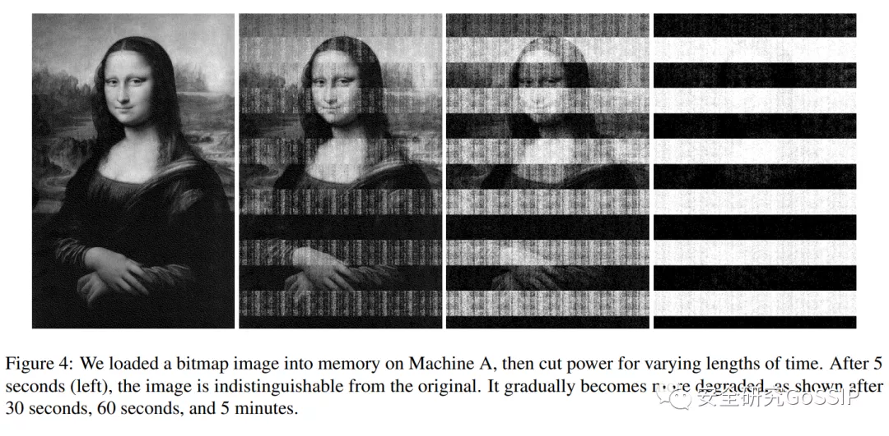

- 安全：
-
  1. PATA: Fuzzing with Path Aware Taint Analysis
	- [好喜欢]这篇论文主要讨论了在fuzzing中路径感知的污点分析技术（path-aware taint analysis）的应用[并不简单]PATA的核心流程分为三步，第一步，寻找所谓的Representative Constraint Variables[并不简单]第二步，基于byte-level的mutation去识别所谓的Critical Byte[并不简单]第三步，利用前两步的信息来开展所谓的Feature Exploit Mutation，得到更多的seeds，把它们丢给常规的fuzzing引擎来发现更多bugs
-
-
  2. 周二为大家推荐的论文是一篇MIT研究人员的调研文章You Really Shouldn’t Roll Your Own Crypto: An Empirical Study of Vulnerabilities in Cryptographic Libraries[好喜欢]作者统计了主流密码学算法库在历史上出现的各类漏洞[思考]发现其中仅有27.2%是密码学相关问题，而内存安全类问题占漏洞比例的37.2%[思考]也就是说，密码学算法库的真正敌人是代码实现安全问题[嘘]
-
-
  3. 教师节为大家推荐的论文是来自USENIX Security 2021的CipherLeaks: Breaking Constant-time Cryptography on AMD SEV via the Ciphertext Side Channel[好喜欢]作者通过提出一种之前没有被探究过的基于密文的侧信道攻击 （ciphertext side channel）来实现对于时下OpenSSL 软件库包的恒定时间加密算法的攻击，并将其命名为CIPHERLEAKs [并不简单]作者以RSA加密和ECDSA数字签名为例，攻击者可以利用CIPHERLEAKs攻击来100%的窃取加密过程中使用的私钥以及签名中使用的随机数。事实上，CIPHERLEAKs 攻击也被认为是第一个能在SEV-SNP上实施的攻击[并不简单]
- CIPHERLEAKs 网页：www.cipherleaks.com
-
-
  4. 昨天为大家推荐的文章是Offensive Security Research in Computer Architecture Conferences[好喜欢]在这篇2017年的blog文章中，两位研究人员在讨论为什么系统结构研究社区不是那么喜欢 attack paper（然而自从meltdown和spectre攻击之后，这个情况貌似已经被排山倒海的讨论相关攻击的论文改变了[doge]）作者发现，老一辈的研究人员往往会说“They found a bug? Is this really computer science/engineering?!”这样的话（在我们安全研究社区，提到做attack大家都是满心欢喜，而提到做defense……满眼都是泪）[doge]于是在这篇blog文章中，作者就来说一说攻击类研究的重要性[doge]
-
-
  5. 周一为大家推荐的论文是An Empirical Cybersecurity Evaluation of GitHub Copilot’s Code Contributions[好喜欢]论文的研究对象是GitHub上目前用来提供代码建议的工具——Copilot（号称“AI和你一起写代码”）[doge]研究人员创建了89个不同的测试场景，生成出1692个程序来测试Copilot，这些场景都和一些安全级别较高的CWE（从MITRE Top 25 list选出）相关，结果自然是发现很多基于Copilot建议生成的代码都存在安全问题[doge]
-
-
  6. 第二十七篇论文推荐是来自IEEE S&P 2022的BadEncoder: Backdoor Attacks to Pre-trained Encoders in Self-Supervised Learning[好喜欢]作者首次提出了针对自监督学习的后门攻击（作者用BadEncoder来表示攻击方法）[并不简单]更具体的说，BadEncoder通过在图像编码器中注入后门（称为后门编码器），并且基于该后门编码器在多个下游任务上建立的下游分类器（称为后门下游分类器）会同时继承后门[思考]也就是说，对于这些下游任务来说，图像编码器形成了单点故障（single point of failure）[吃瓜]这种安全范式广泛存在于计算机系统中，比如在操作系统中注入后门会影响到多个建立在该操作系统之上的上层应用，更改数据库中的数据会影响到多个和该数据库交互的应用程序的结果[并不简单]
-
-
  7. 补更的第十九篇论文推荐是来自USENIX Security 2021的Dirty Road Can Attack: Security of Deep Learning based Automated Lane Centering under Physical-World Attack[好喜欢]作者们研究了「产品级L2自动驾驶系统中的自动车道居中辅助系统（ALC，Automated Lane Centering）」的安全[并不简单]并且设计了脏路补丁（DRP）攻击，即通过在车道上部署「添加了对抗样本攻击生成的路面污渍图案的道路补丁」便可误导OpenPilot （开源的产品级驾驶员辅助系统） ALC系统[吃瓜]并使车辆在1秒内就偏离其行驶车道，远低于驾驶员的平均接管反应时间（2.5 秒），造成严重交通危害[酷]
-
-
  8. 补更的第十七篇论文推荐是来自RAID 2021的On the Usability (In)Security of In-App Browsing Interfaces in Mobile Apps[好喜欢]本文研究了Android和iOS平台上app中内嵌的浏览引擎中存在的安全问题[并不简单]主要在于内嵌的浏览引擎缺乏像浏览器那样的UI提示，在URL不正确或者应该存在各种错误提示的时候，内嵌的浏览引擎无法给用户足够的信息[并不简单]（例如用微信打开一个TLS证书不正确的网页，微信就给你返回一个空白的页面，什么提示都看不到[晕]）。
-
-
  9. 补更的第十二篇论文推荐是来自PLDI 2021录用论文Automated Conformance Testing for JavaScript Engines via Deep Compiler Fuzzing[好喜欢]JavaScript (JS)编程语言是目前使用最广泛的编程语言之一，被广泛应用于智能化、个性化、跨平台等交互系统的设计。JS程序通常需要通过JS引擎在具体的硬件平台上进行动态解释和即时编译执行[并不简单]然而，JS引擎作为一种特殊的软件，难免会存在缺陷甚至漏洞，这会导致编译所产生的JS应用程序存在缺陷[doge]作者提出了Deep Compiler Fuzzing的技术，应用于各个不同的JavaScript引擎上发现大量的bug[酷]
-
-
  10. 补更的第十篇论文推荐是来自OOPSLA 2020的论文Detecting locations in JavaScript programs affected by breaking library changes[好喜欢]NPM registry包含了1.2M包，平均每个包依赖大约80个其他包，大多数库会经常更新，增加一些新特性，修复一些bug和安全漏洞等[并不简单]然而考虑到更新可能会破坏现有的代码，开发者需要查看changelog并手动定位被影响的代码的位置，所以开发者往往不愿意切换到新版本[doge]现有的工具migrate tools，rxjs-compat，npm audit等都无法很好定位具体受影响的代码位置[doge]在本文中，作者引入了简单的模式语言来表示API access point，并基于静态分析开发了模式匹配工具TAPIR来减少开发者的手工工作[酷]
-
-
  11.  补更的第九篇论文推荐是来自USENIX Security 2021的论文ALPACA: Application Layer Protocol Confusion - Analyzing and Mitigating Cracks in TLS Authentication[好喜欢]TLS被广泛的用于应用层协议（HTTP，SMTP，IMAP，POP3，FTP)来保证数据的机密性，完整性和身份认证[并不简单]然而TLS不能将TCP连接和期望的应用程序绑定，这就使得中间人可以重定向TLS流量到另一个IP地址或端口的服务点。这种跨协议的攻击使得一个服务可能会影响给另一个应用层服务的安全性[doge]本文对TLS的跨协议攻击进行了调查，并对现实世界的服务器进行了大规模的扫描和评估[并不简单]
-
-
  12. 补更的第八篇论文推荐是来自IEEE S&P2022的Why Crypto-detectors Fail: A Systematic Evaluation of Cryptographic Misuse Detection Techniques[好喜欢]密码学误用（crypto misuse）的安全检测是安全研究中一项长期受到关注的研究工作[酷]然而这篇论文却发表了一种观点，即当前主流的一些代码扫描工具中提供的自动化密码学误用分析引擎的有效性并不令人满意[并不简单]作者将导致引擎失效的原因总结为5大类19项，在论文中进行了详细的讨论，这对于代码安全问题检测工具的开发人员来说是非常好的总结[憧憬]
-
-
  13. 补更的第七篇论文推荐是来自Usenix Security 2021一篇关于图神经网络模型中的隐私泄漏的工作Stealing Links from Graph Neural Networks[好喜欢]为了更好地处理图结构数据，研究人员提出了一种新型的神经网络——图神经网络 Graph Neural Networks（GNNs）[并不简单]作者提出了第一个针对GNN的link stealing attack[阴险]具体说来，给定任意两个被用来训练GNN的节点，攻击者的目标是预测这两个节点是否相连[并不简单]该攻击揭示了在训练GNN时，训练数据的知识产权和隐私可能会遭到破坏[并不简单]例如，该攻击侵犯了数据所有者的知识产权，因为图数据需要花费大量资源收集；同时，当图数据包含用户之间敏感的社会关系时，该攻击侵犯了用户隐私
-
-
  14. 补更的第六篇论文推荐是来自ICSE 2020的Extracting Taint Specifications for JavaScript Libraries[好喜欢]作者总结了当前静态分析JS代码的难题[并不简单]如下图所示，下面的代码存在着“当用户输入不当路径时，目录下的文件夹会被全部删除”的风险[并不简单]而使用当前的静态分析，就需要理解代码中每个库的含义，或者对库中的所有代码进行静态分析，但是JS库的代码通常数量巨大，且高度动态，因此仅进行静态分析是不够的[并不简单]因此，作者提出了基于动态分析的污点分析的方法
-
- 15.
- 
-
- 在此基础上，Nadia Heninger和Hovav Shacham很快在2009年的美密会上发表了另一篇论文Reconstructing RSA Private Keys from Random Key Bits，给出了一个非常具有震撼力的结论——攻击者只需要随机得到内存中RSA私钥27%的部分，就可以有很大的概率完全恢复整个私钥！